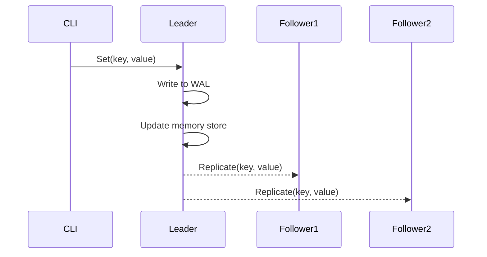

# Replication Design (v1 MVP)

## Overview
This is the initial replication model for the distributed key-value store. It uses a simple leader-follower pattern where the leader replicates writes to all known followers via gRPC.

## Replication Flow
1. Client sends `Set(key, value)` to leader
2. Leader:
    - Writes to WAL for durability
    - Updates in-memory data store
    - Sends `Replicate(key, value)` to each follower (fire-and-forget)
3. Follower:
    - Receives `Replicate()` RPC
    - Updates in-memory store (no WAL or durability for now, will eventually consider log replication)

## RPC Definitions
- `Set()` - client-facing, includes validation and WAL write
- `Replicate()` - internal use, no WAL, minimal logic

## Design Choices
- **Fire-and-forget** replication to minimize latency
- No retries or acknowledgements
- Hardcoded follower list in leader configuration file
- No leader election; single-node coordination assumed

## Future Improvements (Post-MVP)
- WAL on followers (with durability guarantees)
- Acknowledged replication + quorum writes
- Raft-style consensus (leader election, log matching)
- Node health checking + rejoining logic
- Dynamic membership + service discovery

## Notes
- This version is primarily for demonstration and POC purposes
- Trade-offs were made for simplicity and visibility with plans to iterate in the future
